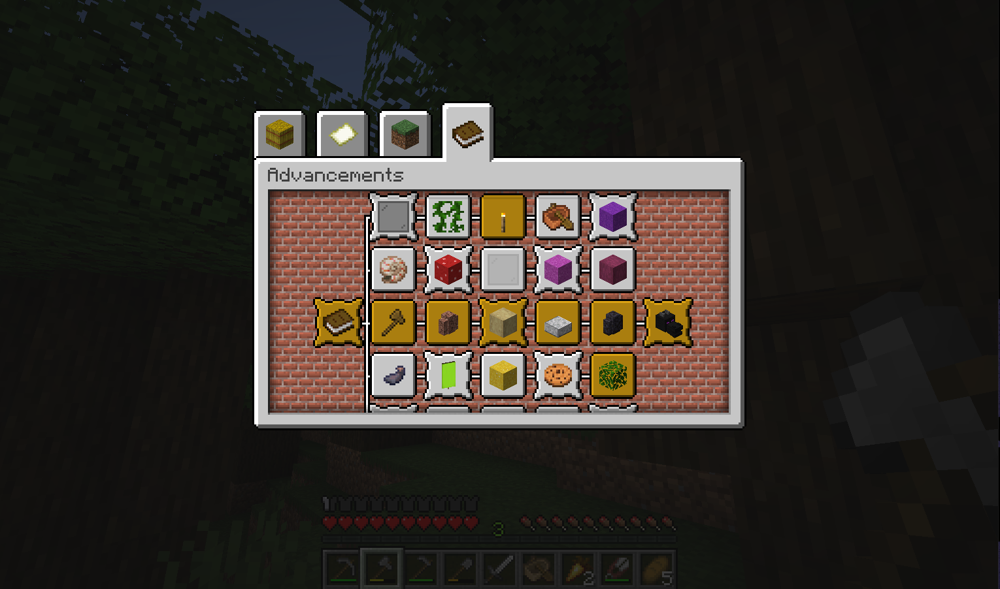

# Minecraft Bingo Generator
A Python script and a datapack skeleton allowing you to generate a simple Bingo board. The generator includes items from Minecraft 1.19 split into multiple categories allowing you to customize your game.

## Usage
To start playing you need to[ **install the datapack**](https://www.planetminecraft.com/blog/how-to-download-and-install-minecraft-data-packs/) and then **run the** ***script.py*** using [Python 3](https://www.python.org/downloads/). This will generate advancements for your bingo game. You can also select which items you want to get included in your game (write '*y'* or '*n'* and press *enter* for each one of them):

* **default** (Most items from overworld obtainable in low to medium amount of time)
* **silktouch** (Items requiring silktouch tool to obtain)
* **nether** (Items requiring to enter the nether - mostly, some are at ruined portals etc.)
* **end** (Items requiring to enter the end, some of them killing the dragon and going to end cities)
* **rare** (Ultra rare items - music disks and chain armor)
* **oceanMonument** (Items mostly from underwater monuments)

Inspired by Swiep's [Minecraft Bingo Datapack](https://www.reddit.com/r/Minecraft/comments/f7iwat/hi_we_made_a_minecraft_bingo_datapack_for_115/) the game gets started by **getting a dirt block** and the board can later be accessed by **pressing L** to open advancements.

You can play with this datapack in singleplayer or multiplayer. Feel free to redistribute or modify the datapack (or update it for future versions), just don't forget to mention the source. Also recording or streaming with this datapack is encouraged, just tag the source so others can find it.
